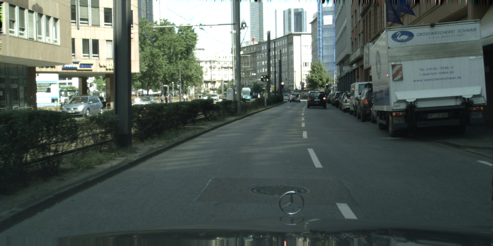
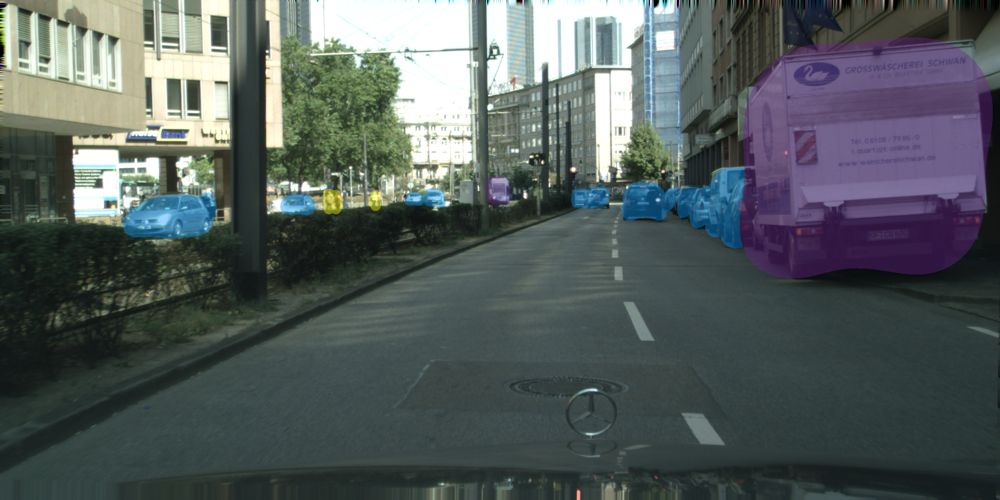
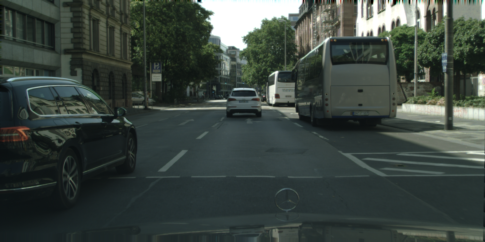
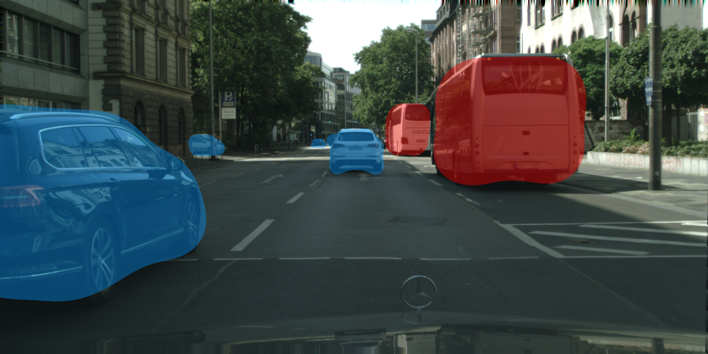
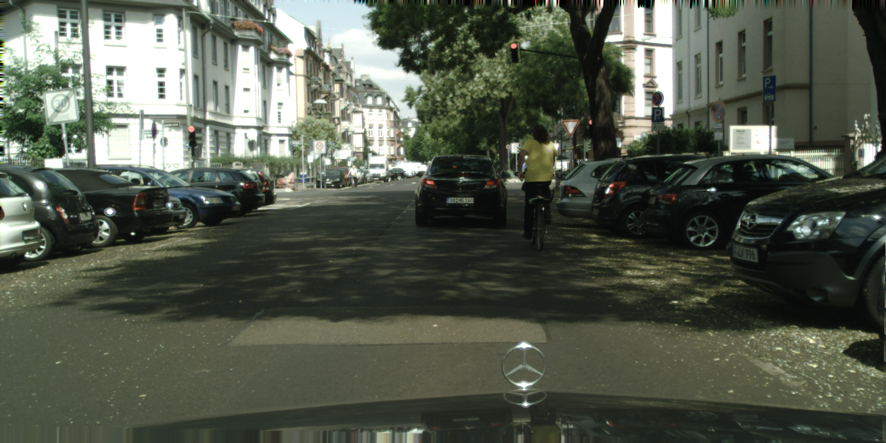
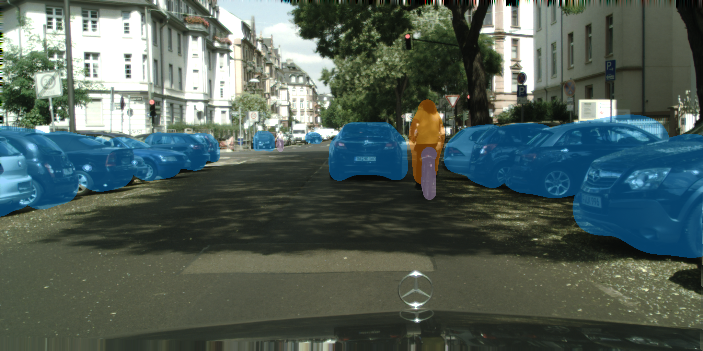

# CenterDisks
Repository for the paper 
  by Katia Jodogne-del Litto1, Guillaume-Alexandre Bilodeau1.
 
1 Polytechnique Montréal

## Abstract

CenterDisks: Real-time instance segmentation with disk covering

## Example results
Initial image      |  Disks covering
:-------------------------:|:-------------------------:
  |  
  |  
  |  

## Requirements:
- python 3.8
- pytorch (1.8.0, cuda 10.2)
- mmdetection (for DCN)
- various common packages (opencv, numpy...)

## Folder organization:
- experiments/: scripts for the experiments.
- Data path expected usually is /store/datasets/DATASET_NAME (changeable in code)
- src/lib/trains/gaussiandet.py is the training file
- src/lib/datasets/sample/gaussiandet.py is the sampling file
- src/lib/detectors/gaussiandet.py is the detector file

## Help
For general debugging and help to run the scripts:  
- This code is built upon: https://github.com/xingyizhou/CenterNet and https://github.com/hu64/CenterPoly
- The pre-trained weights are all available at this location

## Results:

| Datasets (test sets) |   AP  | AP50% | Runtime (s) | weights                                                                                                                                                 |
|:--------------------:|:-----:|-------|-------------|---------------------------------------------------------------------------------------------------------------------------------------------------------|
| cityscapes           | 7.36 | 25.89 | 0.040       | [link](https://polymtlca0-my.sharepoint.com/:u:/g/personal/katia_jodogne--del-litto_polymtl_ca/EbrR4Vx8lL5LlKxrX2OljpwBQJxj_Tb1ku6xycsgGogkQQ?e=IhNEU8) |
| KITTI                | 11.75 | 37.24 | 0.032       | [link](https://polymtlca0-my.sharepoint.com/:u:/g/personal/katia_jodogne--del-litto_polymtl_ca/EXFMImX8TMVKosDeonNoReUBiYnPF2rNLEh8zTTF9zdoiw?e=nUIxEx) |
| IDD                  | 6.70 | 21.40 | 0.033       | [link](https://polymtlca0-my.sharepoint.com/:u:/g/personal/katia_jodogne--del-litto_polymtl_ca/EYgRQhEw0i5Ekuja4pigE6oBlaO43cfE_wXvdYJfgtuVDg?e=i88O39) |

## Models

https://polymtlca0-my.sharepoint.com/:f:/g/personal/katia_jodogne--del-litto_polymtl_ca/ErwvXbsztOpNvtqLw-bWZakBSZV4XtgJyeEXXr-Z2nARQw?e=3uDYa0

## Acknowledgements
The code for this paper is mainly built upon [CenterPoly](https://github.com/hu64/CenterPoly) and [CenterNet](https://github.com/xingyizhou/CenterNet), we would therefore like to thank the authors for providing the source code of their paper. We also acknowledge the support of the Natural Sciences and Engineering Research Council of Canada (NSERC), and the support of IVADO [MSc-2022-4713306544].

## License
CenterDisks is released under the MIT License. Portions of the code are borrowed from [CenterPoly](https://github.com/hu64/CenterPoly), [CenterNet](https://github.com/xingyizhou/CenterNet), [CornerNet](https://github.com/princeton-vl/CornerNet) (hourglassnet, loss functions), [dla](https://github.com/ucbdrive/dla) (DLA network), [mmdetection](https://github.com/open-mmlab/mmdetection)(deformable convolutions), and [cityscapesScripts](https://github.com/mcordts/cityscapesScripts) (cityscapes dataset evaluation). Please refer to the original License of these projects (See [NOTICE](NOTICE)).
